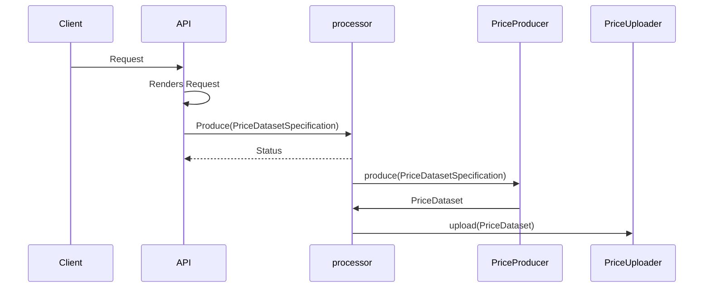
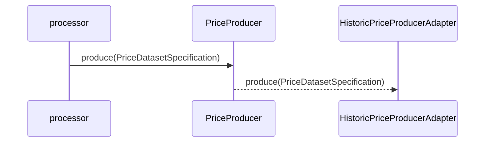
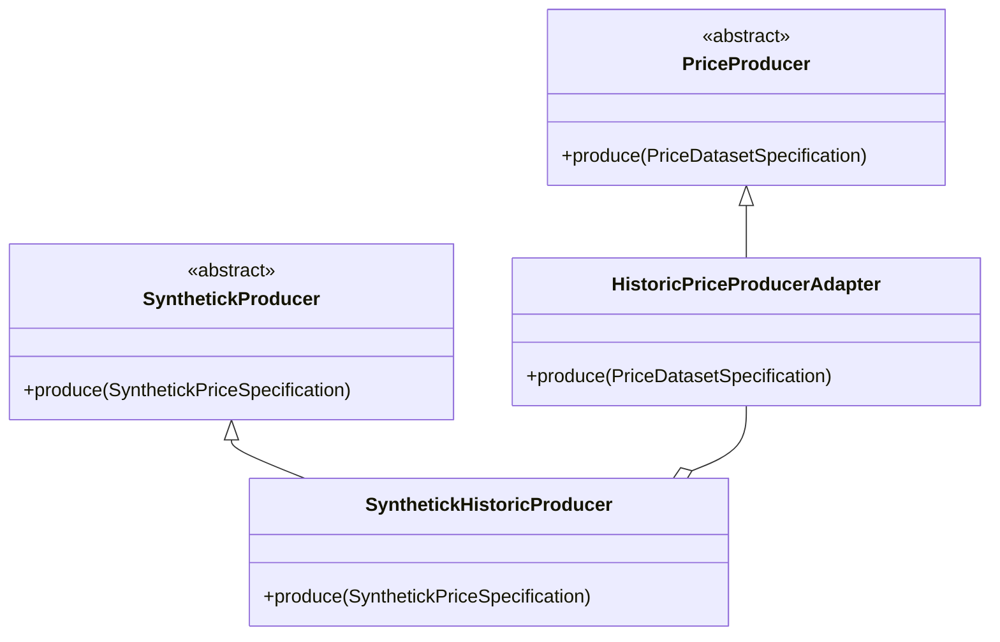
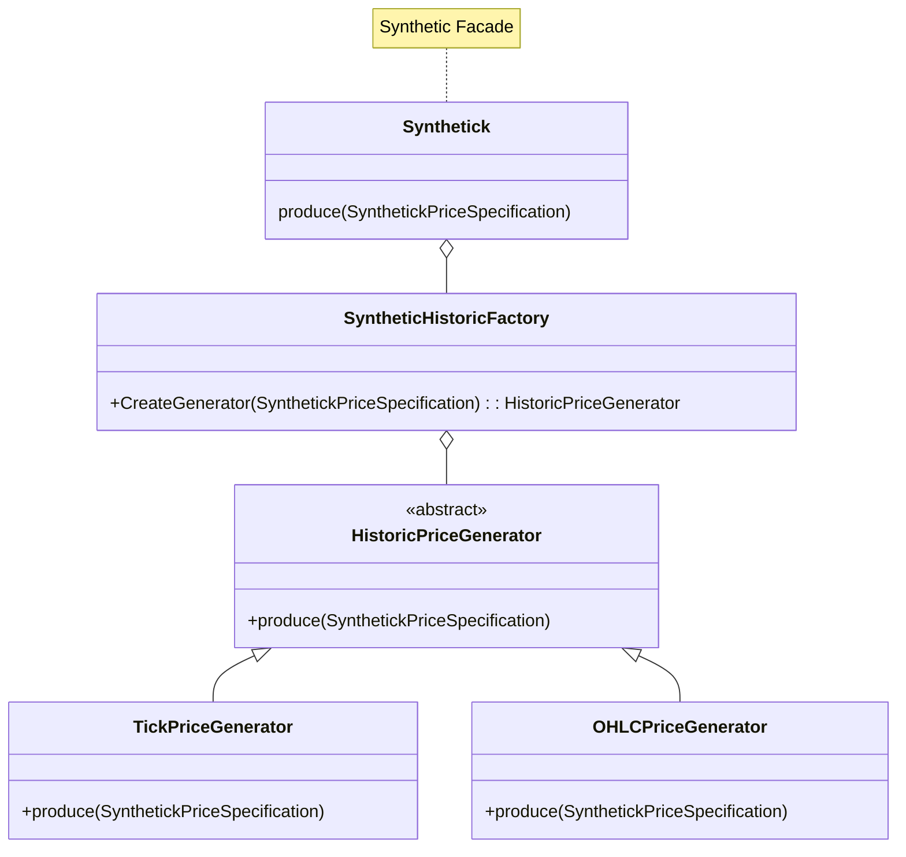

# Architecture Decision Record

## Decoupling Price Generation from API Requests

### Challenge

Coupling between the price generation library and the price generation request needs to be minimized.
Why?, because the synthetic library is still a work in progress and will change in the short term so we need to keep
the API isolated and decoupled of those changes.

### Decision

Apply the Adapter Pattern to isolate the price generation library from the API request.

#### Full Produce Rquests Sequence

#### Price Generation Sequence

####E  Synthetick Adapter 

#### Synthetic Historic Factory/Facade

## Scalable Price Generation Processing

1. The memory space complexity for each request is O(n) where n is the number of price points. 
This can lead to high memory usage and potential performance issues when handling a large number of requests.

2. One option is to process in mini-batches, where is possible to have 

### Challenges

1. For non-regular time series, the calculation of the mini-batch sizes can be tricky, because the to 

### Decision

